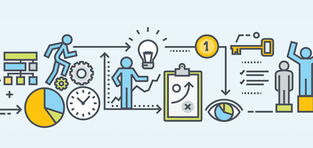

# Business Process as a Service

## Apa itu Business Process as a Service ?  
Proses Bisnis sebagai Layanan (BPaaS) adalah setiap jenis proses bisnis horizontal atau vertikal yang disampaikan berdasarkan model layanan cloud. 
Layanan cloud ini yang meliputi Software sebagai Service (SaaS), Platform sebagai Layanan (PaaS), dan Infrastructure as a Service (IaaS), karena itu tergantung pada layanan terkait.  

  

## Mengapa BPaaS adalah pilihan yang lebih cerdas?  

  

BPaaS dapat dirancang untuk mempertahankan alur kerja proses yang konsisten dan berbeda; menggabungkan manfaat dari platform layanan berbasis cloud yang berbeda seperti IaaS, PaaS, SaaS dan ITaaS.  

• Dapat berfungsi sebagai sistem terpusat di berbagai operasi bisnis dan dapat bekerja secara dinamis.  

• Dapat diskalakan dan dirancang dengan kemampuan untuk mengubah ukuran sesuai dengan perubahan fungsi bisnis.  

• Proses bisnis dapat dipetakan dan dikirim tanpa dukungan eksternal. Ini dapat menjaga transparansi dalam memproyeksikan dan mendapatkan visibilitas yang lebih baik ke dalam fungsi proses.  

• Sangat aman dan dilengkapi dengan berbagai tingkat patch keamanan. Pendekatan proses otomatis mengurangi risiko kesalahan manusia.  

• Alur kerja yang sistematis membutuhkan lebih sedikit gangguan manusia, sehingga mengurangi kebutuhan untuk menggunakan jam kerja manusia yang berharga untuk melakukan tugas-tugas yang membosankan.  

• Akses real-time ke aplikasi dan data melalui layanan berbasis cloud.  

### Source : https://ialnews.blogspot.com/2019/04/bpo-ke-bpaas-pergeseran-yang-lebih.html  

