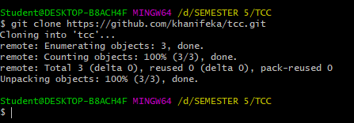

PRAKTIKUM HARI PERTAMA   
By Khanifa Eka Nuryati   
175410074  
1. Melakukan Konfigurasi Git

2. Cek Config pada Git

3. Membuat Repositori pada Git

    Pilih pada New Repository, kemudian tuliskan nama repository yang dikehendaki.

4. Clone 

    Cloning ini untuk membuat folder yang ada pada github juga terdapat pada lokal komputer kita.

5. vim dan cat

    vim digunakan untuk mengedit dan cat digunakan untuk melihat revisi yang dibuat.

6. Status

    untuk melihat bahwa pada repo telah terjadi perubahan

7. Push

    push digunakan untuk mengupload file yang sudah diedit ke repositori. 

