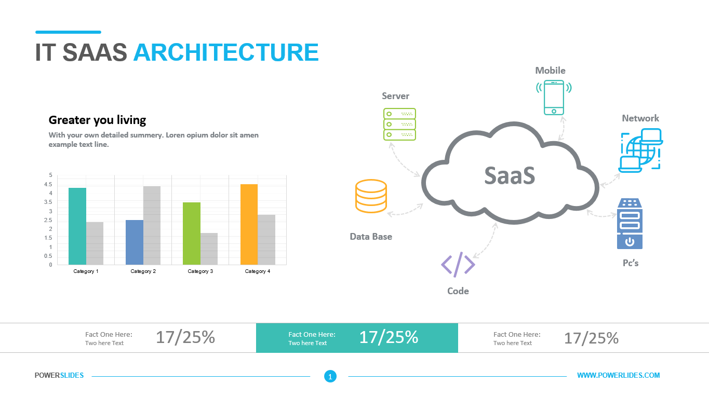
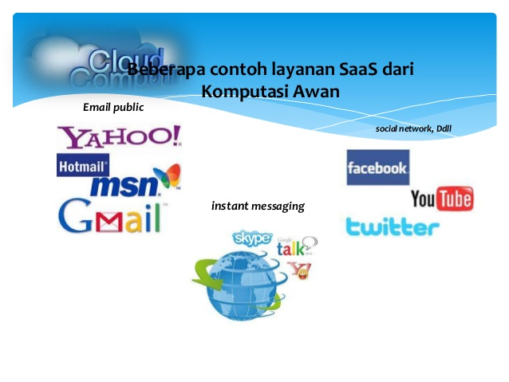

Hai !  
#Apa Yang Dimaksud Dengan Software as a Service ?  
Software as a service atau yang biasa dikenal dengan SaaS, adalah suatu layanan yang dibentuk didalam suatu perangkat lunak. SaaS sendiri bertujuan untuk memberikan kemudahan para pengembang aplikasi berbasis web yang nantinya akan diakses dan digunakan oleh pelanggannya dengan koneksi Internet.

##Arsitektur SaaS  
Model SaaS meliputi konsep-konsep dalam arsitektur aplikasi terdistribusi tetapi lebih lanjut memperluas arsitektur untuk menyertakan komponen untuk memfasilitasi dan meningkatkan model
bisnis. Sebuah vendor perangkat lunak tradisional terutama berkaitan dengan kemampuan aplikasi dan pelanggan mereka yang bertanggung jawab untuk mengoperasikan dan mengelola lingkungan yang bersangkutan di mana mereka menjalankan perangkat lunak. 

  

##Cloud Software asaService (SaaS).  
Kemampuan yang diberikan kepada konsumen adalah dengan menggunakan aplikasi penyedia yang berjalan pada infrastruktur awan. Aplikasi dapat diakses dari berbagai perangkat klien
melalui antarmuka thin-client seperti Web browser (misalnya, Web-based email). Konsumen tidak mengelola atau mengendalikan infrastruktur awan termasuk jaringan, server, sistem operasi, penyimpanan, atau kemampuan aplikasi bahkan individu, dengan
pengecualian terbatas khusus bagi pengguna untuk pengaturan konfigurasi aplikasi.  

###Ada beberapa tipe software yang ditawarkan pada SaaS, yaitu :  
1. Manajemen resources bagi pelanggan
2. Video Conferencing
3. Manajemen Layanan IT
4. Akunting
5. Analisa Web
6. Manajemen web content  

Rata-rata aplikasi yang ditawarkan pada SaaS adalah aplikasi yang tidak memerlukan banyak interaksi dengan antarmuka lain serta memiliki kegunaan yang simpel. Tentu saja karena aplikasi-aplikasi ini akan dipakai oleh ratusan bahkan ribuan lebih user!  

Berbeda dengan grid computing (akan dijelaskan di postingan lainnya) atau sistem terdistribusi lainnya, aplikasi-aplikasi yang ditawarkan pada SaaS biasanya web-native yang artinya diakses melalui web browser. Aplikasi tersebut juga harus multitenant yaitu memperbolehkan banyak user mengakses sekaligus.
Sejauh ini SaaS terlihat bagus? Yah, itu tergantung dari kebutuhan kita. Sekali lagi saya tegaskan bahwa SaaS hanya cocok untuk aplikasi yang simpel! Jika sebuah perusahaan membutuhkan sebuah proses komputasi yang spesifik, mungkin perusahaan tersebut tidak akan menemukan apa yang mereka cari di SaaS. Lalu terdapat ‘ketergantungan’ terhadap provider tertentu. Jika kita ingin memindahkan data-data kita dari satu provider ke provider lainnya, ada dua kemungkinan. Pertama, tidak bisa (terjadi jika kedua provider tidak menjalin kerjasama) atau membutuhkan biaya mahal (jika kedua provider bekerjasama – tentu saja mereka, kan, ingin untung!)  

Musuh utama dari SaaS adalah aplikasi-aplikasi open source. Tentu saja, alasan orang menggunakan SaaS salah satunya adalah karena biaya supporting dan updating aplikasi tersebut ditanggung oleh provider. Jika ada yang open source, maka mereka akan menginstalasi aplikasi tersebut di mesin lokal dan berarti tidak membutuhkan SaaS!  

Tipe layanan berikutnya adalah Platform as a Service (PaaS). Mirip dengan SaaS, PaaS juga menawarkan layanan aplikasi, hanya saja PaaS juga menawarkan platform yang kita butuhkan untuk membuat aplikasi-aplikasi. PaaS juga sering disebut cloudware, dikarenakan kita mengakses platform tersebut via cloud computing.  

##Contoh SaaS
   

- 175410074 -