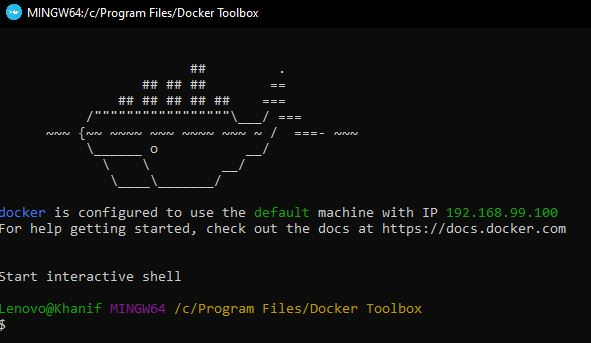
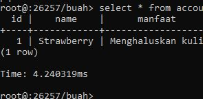

# CockroachDB  
Part ini berisi bagaimana membuat database dengan menggunakan CockroachDB  . 
Langkah yang harus dilakukan :

1.   Install Droker ( Link dibawah)   
[ Docker Toolbox](https://docs.docker.com/v17.12/toolbox/toolbox_install_windows/)  
Doker ini digunakan sebagai  sebuah aplikasi open source yang berfungsi sebagai wadah/container untuk mengepak/membungkus sebuah software secara lengkap beserta semua hal lainnya yang dibutuhkan oleh software tersebut sampai dapat berfungsi. Pengaturan software beserta file/hal pendukung lainnya akan menjadi sebuah Image (istilah yang diberikan oleh docker). Kemudian sebuah instan dari Image tersebut kemudian disebut Container.  
  
Jika sudah muncul seperti gambar diatas, maka instalasi docker sudah berhasil. Lanjuuuuuuuuut ke database!   

2. Install CockroachDB  
Untuk Download dan Tutorialnya bisa klik link dibawah  
[ CockroachDB ](https://www.cockroachlabs.com/docs/stable/install-cockroachdb-windows.html)  
  
Jika sudah sesuai dengan gambar diatas, itu berarti database berhasil terinstall.  

3. Start The First Node  
  
Perintah ini dibuat untuk menciptakan kontainer/wadah untuk CockroachDB. Pastikan Username ini adalah nama yang sama dengan yang sudah dibuat. disini usernamenya adalah roach1.  

4. Bridge Network untuk Docker  
  

5. Check Running Container  
  
Ini berfungsi untuk mengetahui apakah container yang sudah diaktifkan sudah berjalan.  

6. Login ke CockroachDB  
  
Ini berarti kita sudah masuk ke dalam CockroachDB.  Perintah ini untuk memulai shell pertama pada CockroachDB.  

7. Create Database  
  
Sama dengan perintah pada umumnya, untuk membuat database menggunakan perintah CREATE DATABASE.  

8. Use Database  
  
Use ini digunakan supaya jika nanti kita membuat tabel atau insert data bisa langsung default ke database yang kita pilih.  

9. Create Table  
  
Sukses membuat table :)  

10. Insert Data  
  
  
  Biar ga Kosong gaeeeees. hehe  

11. Show The Table  
  
Done :)  
  
    

      
      
### - 175410074 -