## Deploy Redis as a Docker Container  
Terdapat sebuah skenario, dimana kita berperan sebagai jane, yaitu developer yang perlu menggunakan Key-Value Store baru untuk aplikasi yang sedang bekerja dengannya. Setelah berdiskusi, diputuskan untuk menggunakan Redis.  
Skenario ini membahas bagaimana dia akan menyelesaikan tugasnya dan menggunakan Redis sebagai Docker Container.  

### What is Docker ?  
Platform terbuka bagi pengembang dan sysadmin untuk membangun, mengirim, dan menjalankan aplikasi terdistribusi, docker memungkinkan Anda untuk menjalankan kontainer.  

Terdapat 3 Skenario yang harus dijalankan oleh Jane.  

## Let's Start !!!  
1. Searh Readis    
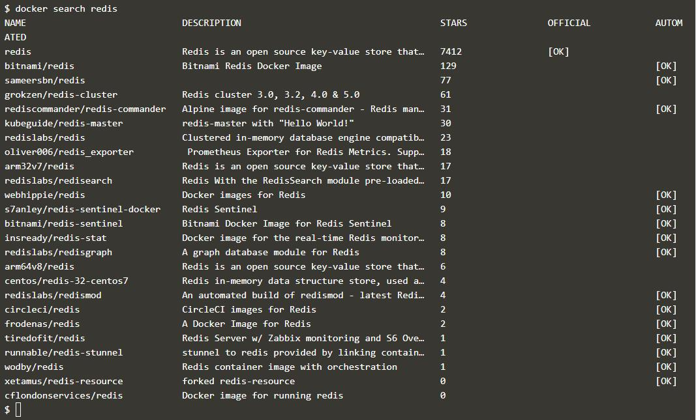  
Command diatas digunakan untuk menemukan docker image redis.  

2. Running Redis  
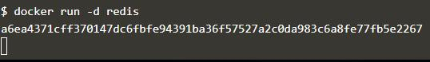    
Dengan menggunakan command seperti pada gambar, maka redis akan berjalan dengan versi terbaru.  

3. Finding running containers    
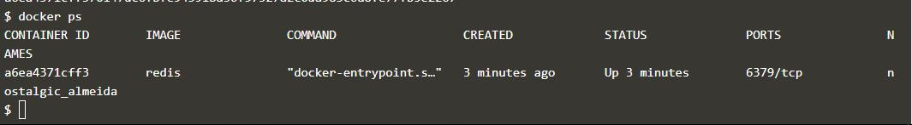  
Command diatas digunakan untuk mengetahui container apa saja yang sedang berjalan dan info secara detail.  

4. Accessing Redis      
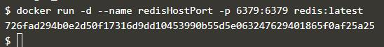  
untuk dapat mengakses container ini, maka kita harus memanggil port pada redis dan container yang diekspos melalui sebuah host, Redis berjalan pada port 6379.    
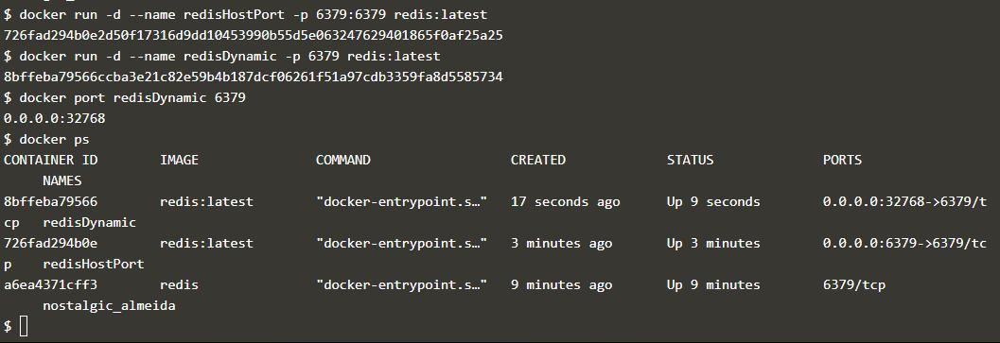      
untuk mengakses redis pada port yang tersedia secara acak, dan untuk melihat pada port mana redis ini berjalan.   

5. Persisting Data    
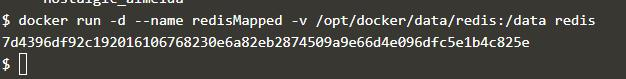  
Supaya data pada container tidak hilang ketika memindah ataupun membuat kontainer baru, sehingga data yang sebelumnya dapat di restore.  

6. Running A Container In The Foreground  
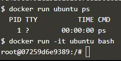    
Ubuntu dapat menjalankan perintah menggunakan bon / bash.  

## Deploy Static HTML Website as Container  
Bagaimana membuat Docker image untuk menjalankan Website static HTML menggunakan Nginx.  

1. Create Docker file  
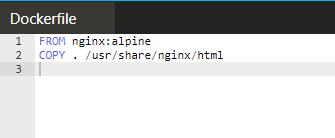    

2. Build Docker Image  
 Create Docker file    
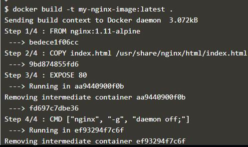   

3. Run  
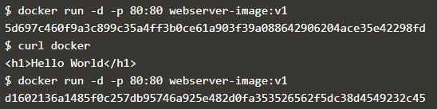   
Mengakses docker image melalui port 80    
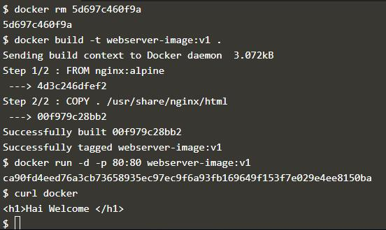     
Hello World ini dapat diganti dengan Kata lain. Stop terlebih dahulu docker yang sedang berjalan, kemudian rm dan build kembali webserver.  

## Building Container Image  

Docker Image dibangun berdasarkan Dockerfile.   Dockerfile mendefinisikan semua langkah yang   diperlukan untuk membuat Docker Image dengan     aplikasi Anda dikonfigurasikan dan siap dijalankan sebagai Kontainer. Image itu sendiri berisi   segalanya, dari sistem operasi hingga dependensi   dan konfigurasi yang diperlukan untuk menjalankan   aplikasi Anda.    

1. Base Image  
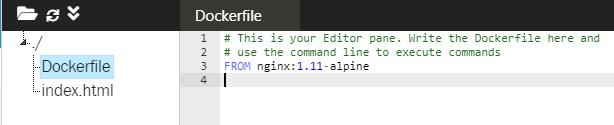    
ini berfungsi untuk membuat Docker File.  

2. Running Commands    
    
untuk mengkopi index.html kedalam directory yang dipanggil.  

3. Exposing Ports  
    
Supaya Docker image dapat diakses melalui port yang sudah ditentukan.  

4. Default Commands    
    
untuk menjalankan nginx.  

5. Building Containers    
    
      

6. Launching New Image    
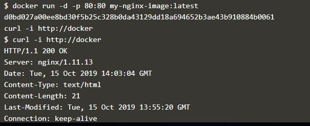  
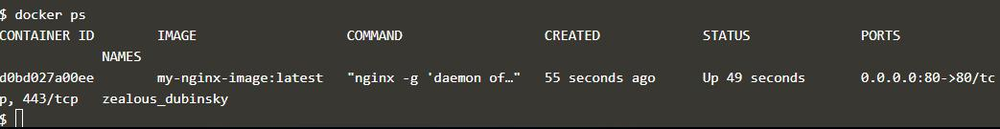  

Done :)    

### - 175410074 -

