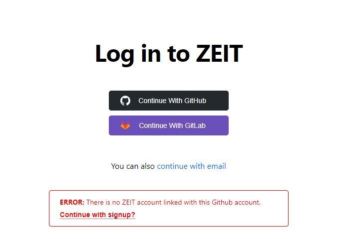
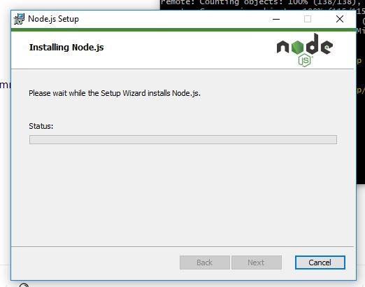
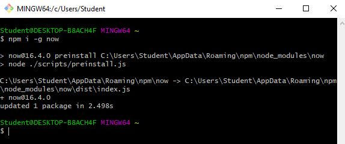
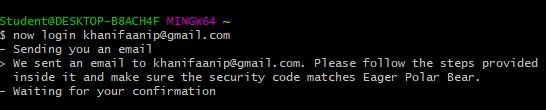
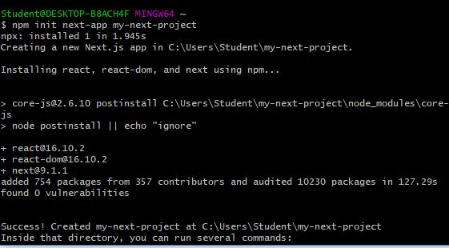
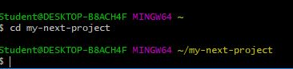
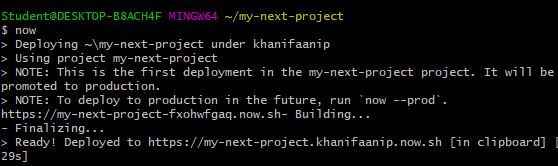
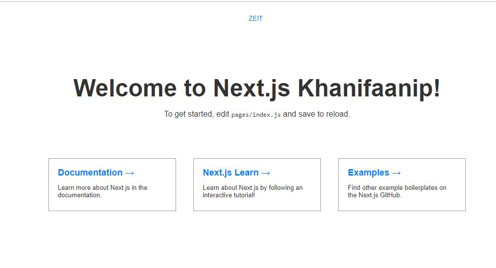

1. Login to Zeit Account  
  

2. Install npm  
npm ini digunakan untuk menjalankan perintah pada zeit.  
  
[Download npm Node.js](https://nodejs.org/en/download/)  

### Setelah melakukan instalasi node.js, konfigurasi selanjutnya di lakukan di command promt atau bash.  

3. Install Now CLI  
    

4. Login from Terminal  
  
Verifikasi akan dikirimkan ke email yang dituliskan.  

5. Creating a Project and Deploying  
  
  

6. Now 
  
  

Done :) Aku sudah resmi bergabung !

### - 175410074 - 

