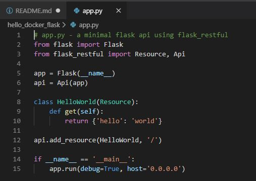
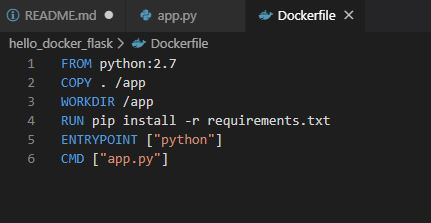
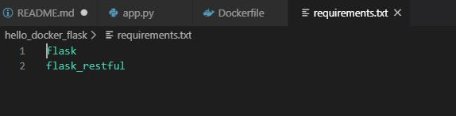
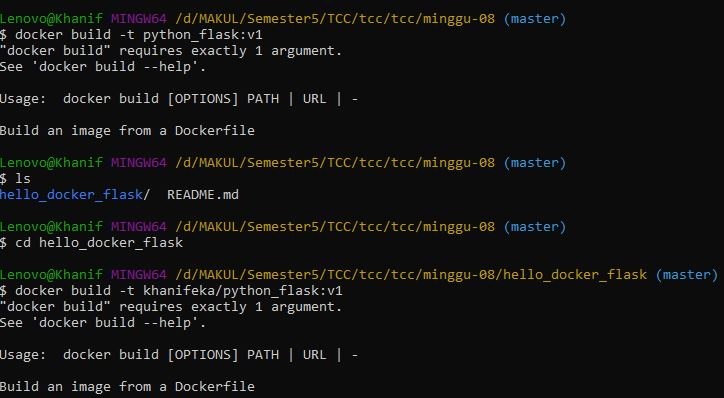
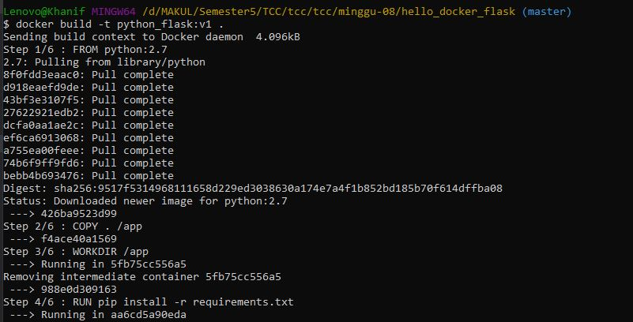
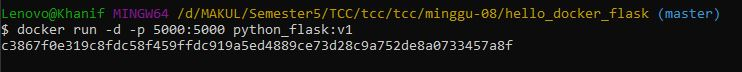

# Docker Flask !
Yang harus kamu punya :  
## Pastikan sudah menginstall Pyhton  

1. Membuat Folder (nama bebas) disini folder saya bernama hello_docker_flask.  
2. Isi dari folder tersebut adalah app.py , Dockerfile, dan requirements.  
3. Maisng masing isi dari file adalah  
app.py  
   

Dockerfile  
  

requirements.txt  
  

4. Build Docker Images    
  
Pastikan masuk terlebih dahulu pada path yang folder hello_docker_flask.  
Ternyata waktu itu masih error hehe perintah untuk membuat image kurang titik.  
  

 5. The Last  
 Running your docker flask  
   

 Done :)   

 
My Reference   

PYTHON + FLASK  
https://medium.com/@mtngt/docker-flask-a-simple-tutorial-bbcb2f4110b5  

-175410074 -
