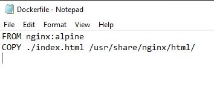
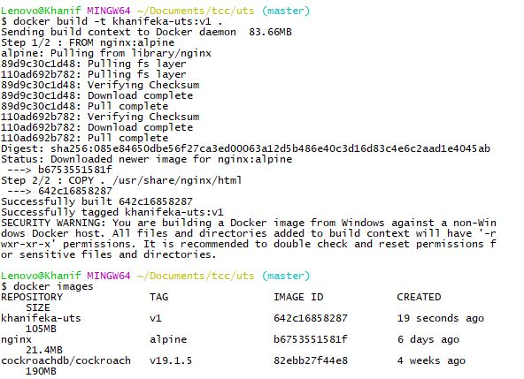

# Khanifa Eka Nuryati  
# UTS !  
# 175410074  

## Skenario : Anda harus punya image di DockerHub. image tersebut dibuat menggunakan Dockerfile, dan Dockerfile tersebut diletakkan di GitHub.  

Let's Try !  
Docker image ini kan sebuah template yang bisa berisi aplikasi ataupun OS, jadi jika akan meletekan aplikasi juga boleh, namun docker image yang saya buat ini berisi web html saja..  

1. Buat Sebuah File lalu beri nama Dockerfile yang berisi  
  
File ini diletakan pada satu folder dengan aplikasi / html.  
index.html adalah nama dari file web yang dibuat.  

2. Membuat Docker File  
  
untuk membuuat 
